<div align="center">

<!-- ░░ HEADER — custom SVG trading chart ░░ -->


<!-- TYPING ANIMATION -->
<a href="https://github.com/Max">
  
</a>

<br/>

<!-- BADGES -->
[](https://www.tradingview.com/)
[](https://vercel.com/)
[](https://notion.so/)

</div>

---

## 🧠 À propos de moi

```python
max = {
    "focus"     : ["Crypto Scalping", "Web Dev", "Data & Python"],
    "markets"   : ["BTC", "ETH", "SOL"],
    "timeframes": ["1m", "5m", "15m"],
    "stack"     : ["Pine Script", "Next.js", "React", "Python", "Vercel"],
    "currently" : "Building a trading dashboard + sharpening my edge 📊",
    "motto"     : "Protect the capital. Let the profits run. 🎯"
}
```

---

## 📊 Trading & Pine Script

> Scalper on short timeframes, focused on **BTC / ETH / SOL** — capital preservation first.

- 📐 **Market Structure** — HH/HL/LH/LL pattern recognition
- 🧪 **Backtesting** — iterative strategy refinement on TradingView
- 📓 **Trade Journal** — Notion-based logging with win rate & R/R tracking
- 🖥️ **Dashboard** — Next.js + Notion API + Vercel *(in progress)*

---

## 🛠️ Stack & Outils

<div align="center">


</div>

---

## 📈 GitHub Stats

<div align="center">


</div>

<div align="center">


</div>

---

## 🔥 En ce moment

- 🏗️ **Trading Dashboard** — Next.js · Notion API · KPIs (Win Rate, P&L, R/R)
- 📊 **Pine Script v5/v6** — scalping strategies on crypto
- 🐍 **Python** — projets data & automatisation
- 🎓 **CS** — apprentissage continu des fondamentaux

---

<div align="center">

<!-- ░░ FOOTER — custom SVG chart continuation ░░ -->


</div>
